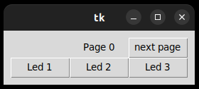
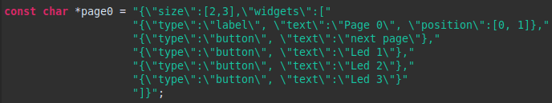

# Nucleo remote controller
This repository is semester project for class B2B99PPC.

## Description
Project consists of library(server/Core/Src/controller_server)
for nucleo development board and desktop GUI(client/src/main.py).

Library allows creating applications for nucleo development board
with remote internet control,
without need of implementing GUI/internet communication.
Emphasis in design was on keeping nucleo
library as light weight as possible(
mostly by off-loading UI processing to desktop ).
Library allows connection of more clients at one time.

Separate documentation of both parts
could be found as README in respective folders.

### Controller description from user perspective
After connecting to server using GUI and entering ip-address and port, control page
consisting of widgets appears( currently supported widgets:
button, switch, entry, label, value).
Each event(like button press or filled entry) is sent to nucleo board.
User can also see device status thanks to value/label widgets.



### Controller description from programmer perspective
Controller library forces creating event driven programs.
After initial setup and callback registrations, mainloop must be called.
Idle callback serves purpose of normal infinite loop(must **not** block).
For each value change(from GUI) value change callback is called.
This is place where behaviour of widgets should be implemented.

Controller consists of one or more pages.
Each page is described by JSON object, values associated with widgets and
callback.



For more indepth documentation of library see server/README.md

## Documentation
This part is dedicated for documentation common for both parts
(protocol used for communication between client and server).

### Communication protocol
Client(GUI) and server(nucleo board) communicates over TCP.
Each message sent from server to client consists of prefix and payload.
- Prefix is 4-byte unsigned integer signifying length of payload
- Payload is JSON object

Messages sent from server contain only payload as described previously( 
protocol relies on fact that messages sent from client are short 
and therefore should not be fragmented when arriving, but it is obviously
big vulnerability ).

### Client-server dialog

When connection opens, server sends message containing
version information( to allow easier backwards compatibility in future ) and initial page id.

```
{"VERSION": 1, "PAGE": 0}
```

Client is now responsible for showing page 0 to user.
Client can request contents of page 0 with message:

```
{"CMD": "GET", "VAL": {"PAGE": 0}}
```

Server response to such message will be for example:

```
{"size": [2, 3], widgets: 
[{"type": "button", "text": "Press me!"},
 {"type": "switch", "text": "Down,Off,Up"},
 {"type": "entry", "text": "Enter password: "},
 {"type": "label"},
 {"type": "value", "text":"Height", "unit":"m", "value_type": "float"}
]}
```

This is description of page 0. Now client can display page.
Client still needs to get values associated with widgets.
This can be achieved with message:

```
{"CMD": "POLL"}
```

Response to this will be for example:

```
{"VAL":"BIN"}
\x00\x00\x00\x00\x01
\x01\x00\x00\x00\x01
secret password\x00\x01
Example\x00\x00
\x3d\xcc\xcc\xcd\x01
```

In example values are separated in lines per widget but in actual
communication it is not the case.
Each widget has type associated with its value
(int32, float, null-terminated string).
ARM on nucleo board is little endian,
so little endian is also used for binary data.
Furthermore, each widget can be enabled/disabled( last byte in each line ).

After values are shown, user can interact with GUI. Client sends 
each event **one at a time** to server with message:

```
{"CMD": "SET", "VAL": [0, 1]}
```

Where VAL attribute is **[widget id, value]** pair.
**Widget id** is simply order of widget as it appears in page description
starting from 0. Value is integer, float or string.
Response to this can be either message containing values
same as response to POLL or command to change page:

```
{"PAGE": 1}
```

As you can see, changing page in GUI can be
triggered only by interaction with GUI( in server code you
can change page only from value change callback ).
Client is responsible for sending SET commands
only for page which is currently displayed and only
for widgets which are enabled.
Consequence of this is that if button press down is programmed to change page,
and user presses button, first message about press is sent.
Response to this would be page change.
Client would then need to drop all events that happened afterwards,
including button release. This means that if page is loaded again,
button should remain pressed. This is usually not desired behaviour.
Easy fix is to program server to respond with page change to button release.
Client also has to drop queued events if widget becomes disabled.

It can be also noted that client can and should cache description of pages.
Meaning that after all pages are discovered by client, GET command is no longer used.

### Summary of commands
- **GET :** response is page description
- **POLL :** response are values
- **SET :** response are values or command to change page