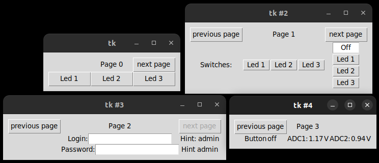

# Description

This folder contains example for controller library use.
Standalone library source code could be found inside Core/Src/controller_server folder,
and associated header files in Core/Inc/controller_server folder.

Reason for providing library in this form is fact that controller is dependent on LWIP stack,
which is in turn dependent on hardware.
Instead of making LWIP port for STM32F7XX/LAN8742 part of library, it is available as this example.
This makes porting possible for other devices.

With this said it is worth noting dependencies present in controller on LWIP port:
```
extern ip4_addr_t ipaddr; // ip address to which server is bound
```
When using example, you will probably also have to change this ip address inside LWIP/App/lwip.c
or using CubeMX to match your network.


Controller also uses:
```
MX_LWIP_Process();
```
This call fetches link-layer frames from low-level hardware drivers,
and gives them to LWIP stack for processing.

Port/drivers for Nucleo-f7xx were generated using STM32CubeMX/STM32CubeIDE configuration software.
Folder contains all Cube metadata files to make importing project possible.
This is recommended way of use since example does not provide build system.


## Overview
Library API is very simple with only 6 functions:
```
void server_init( void );

uint16_t
add_page( const char *page_description,
          w_val_t *page_content,
          uint16_t widget_count,
          void (*update_callback)( uint16_t widget_id,
                                   w_val_t *old_value ) );

void register_idle_callback( void (*idle_callback)( void ) );

void change_page( uint16_t page_id );

void set_start_page( uint16_t page_id );

err_t mainloop( void );
```

*For complete documentation of these functions generate documentation run `doxygen` in terminal from this folder.*

Intended use of library can be summarised to following steps:

1. Initialize low-level drivers for LWIP port(`HAL_Init, SystemClock_Config, MX_LWIP_Init` in example).
2. Initialize server( `server_init()` ).
3. Add pages to controller( `add_page(...)` ) [and register idle_callback].
4. Call `mainloop()`

### Pages
Page from server perspective consists of
**page description, values** and **callback**.

**Page description** is string which tells client how should be GUI for this page rendered.
It is not interpreted by server in any way.
This ensures that GUI can have rich features, while keeping controller light-weight.
For documentation of how page description see *client/README.md*.

**Values** is array that contains contents of most widgets(
label widget does not have value associated with it since it does not change ).
For storing values w_val_t structure is used.
It contains data type of stored value(int32,float or null-terminated string pointer),
actual value inside union and whether widget is enabled.

**Callback** is function which is called when client interacts with GUI.
Callback receives widget_id of widget which changed and old value of widget( 
new value is already stored inside values array ).
If desired behaviour is to keep old value, it needs to be manually assigned back to array.
Callback is called between reception of `SET command` and response sending.
Widget behaviour should be implemented inside callback.
This is also only place where page can be changed( for reason why see *Multiple connections* section ).

### Multiple connections
Controller in a way which allows having multiple independent connection concurrently.
Idea is that sever can be accessed by multiple clients, each having displayed different page.
To allow this behaviour multiple compromises had to be made.
Because reason for creating this library was to make creation of application easier,
it is needed to abstract away all information about connections.
This leaves no option but to limit page changing to callback,
to be able to decide which connection needs page change.
This approach has some drawback, for example you can't change page as result of some internal event.

When designing UI bear in mind that multiple pages can be loaded at a time.

